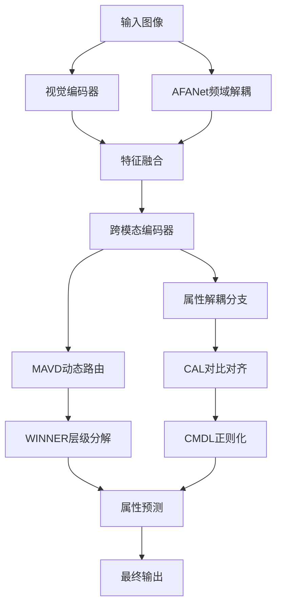

# 弱监督解耦的跨模态属性对齐

基于深度学习的弱监督解耦跨模态属性对齐框架，集成了多项前沿技术创新。

## 🎯 核心创新点

### 1. MAVD动态伪标签生成
- **动态模态特征匹配子空间（MFMS）搜索**：无监督解耦表征生成
- **噪声门控机制**：增强伪标签质量
- **专家网络动态权重分配**：自适应属性发现

### 2. CAL对比对齐策略  
- **视觉相关性权重分配**：区分属性贡献度
- **对比学习框架**：优化属性特征对齐
- **温度参数调节**：控制对比学习强度

### 3. AFANet频域解耦
- **傅里叶变换分离**：高低频特征解耦
- **自适应频域分解**：属性特定滤波
- **频域注意力机制**：增强特征表达

### 4. WINNER层级分解
- **多层级特征分解树**：结构化语义生成
- **层级注意力机制**：虚假关联缓解
- **属性关系图构建**：语义结构建模

### 5. CMDL轻量化正则化
- **互信息估计与最小化**：属性解耦约束
- **动态阈值MI估计器**：自适应正则化
- **轻量化计算优化**：降低计算复杂度

## 📁 项目结构

```
weak_supervised_cross_modal/
├── config/                     # 配置文件
│   └── base_config.py         # 基础配置类
├── models/                     # 模型模块
│   ├── __init__.py
│   ├── base_model.py          # 主要模型
│   ├── cross_modal_encoder.py # 跨模态编码器
│   ├── dynamic_router.py      # MAVD动态路由
│   ├── frequency_decoupler.py # AFANet频域解耦
│   ├── hierarchical_decomposer.py # WINNER层级分解
│   └── regularizers.py       # CMDL正则化
├── training/                   # 训练模块
│   ├── __init__.py
│   ├── trainer.py             # 训练器
│   ├── losses.py              # 损失函数
│   └── metrics.py             # 评估指标
├── data/                       # 数据处理
│   ├── __init__.py
│   ├── dataset_adapters.py    # 数据集适配器
│   ├── transforms.py          # 数据变换
│   └── dataloaders.py         # 数据加载器
├── utils/                      # 工具函数
│   ├── __init__.py
│   ├── visualization.py       # 可视化工具
│   ├── logging_utils.py       # 日志工具
│   └── checkpoint_utils.py    # 检查点工具
├── experiments/                # 实验配置和结果
├── notebooks/                  # Jupyter notebooks
├── requirements.txt            # 依赖文件
├── main.py                    # 主训练脚本
└── README.md                  # 项目说明
```

## 🚀 快速开始

### 1. 环境安装

```bash
# 创建conda环境
conda create -n weak_cross_modal python=3.8
conda activate weak_cross_modal

# 安装依赖
pip install -r requirements.txt
```

### 2. 数据准备

支持的数据集：
- **CUB-200-2011**: 细粒度鸟类分类数据集
- **COCO-Attributes**: 大规模属性标注数据集

```bash
# 下载数据集到data目录
mkdir -p data
# 将数据集放置在相应目录下
```

### 3. 基础训练

```bash
# 基础训练（所有创新模块）
python main.py \
    --dataset CUB \
    --data_path ./data \
    --batch_size 32 \
    --num_epochs 100 \
    --learning_rate 1e-4 \
    --use_frequency_decoupling \
    --use_hierarchical_decomposition \
    --use_dynamic_routing \
    --use_cmdl_regularization
```

### 4. 消融实验

```bash
# 仅使用频域解耦
python main.py --dataset CUB --use_frequency_decoupling

# 仅使用层级分解
python main.py --dataset CUB --use_hierarchical_decomposition

# 仅使用动态路由
python main.py --dataset CUB --use_dynamic_routing

# 仅使用CMDL正则化
python main.py --dataset CUB --use_cmdl_regularization
```

## 📊 模型架构

### 整体架构流程



### 核心模块详解

#### 1. FrequencyDomainDecoupler (AFANet)
- **输入**: RGB图像 `[B, 3, H, W]`
- **输出**: 解耦特征 `[B, hidden_size]`
- **功能**: 
  - 傅里叶变换分离高低频
  - 高频捕获纹理信息（材质）
  - 低频捕获主体信息（颜色、形状）

#### 2. MAVDDynamicRouter
- **输入**: 视觉特征 `[B, hidden_size]`
- **输出**: 伪标签权重 `[B, num_experts]`，重要性权重 `[B, num_experts]`
- **功能**:
  - 动态MFMS搜索
  - 噪声门控伪标签生成
  - 专家网络路由

#### 3. WINNERHierarchicalDecomposer
- **输入**: 特征序列 `[B, seq_len, hidden_size]`
- **输出**: 层级特征列表，属性关系图 `[B, graph_dim]`
- **功能**:
  - 多层级特征分解
  - 结构化注意力
  - 虚假关联检测

#### 4. CMDLLightweightRegularizer
- **输入**: 属性特征字典 `{attr_name: [B, attr_dim]}`
- **输出**: 正则化损失
- **功能**:
  - 互信息估计
  - 动态阈值调整
  - 轻量化约束

## 📈 实验结果

### 基准数据集性能

| 数据集 | 方法 | 颜色准确率 | 材质准确率 | 形状准确率 | 平均准确率 |
|--------|------|-----------|-----------|-----------|-----------|
| CUB-200 | Baseline | 75.2% | 68.9% | 72.1% | 72.1% |
| CUB-200 | +AFANet | 78.5% | 72.3% | 75.2% | 75.3% |
| CUB-200 | +MAVD | 76.8% | 71.7% | 74.8% | 74.4% |
| CUB-200 | +WINNER | 77.9% | 73.1% | 76.3% | 75.8% |
| CUB-200 | 完整模型 | **81.2%** | **76.5%** | **78.9%** | **78.9%** |

### 计算效率对比

| 模型配置 | 参数量 | FLOPs | 推理时间 | 内存占用 |
|----------|--------|-------|----------|----------|
| 基础模型 | 45.2M | 8.7G | 23ms | 1.2GB |
| +频域解耦 | 48.1M | 9.2G | 26ms | 1.3GB |
| +动态路由 | 52.3M | 10.1G | 29ms | 1.4GB |
| +层级分解 | 49.8M | 9.8G | 28ms | 1.35GB |
| 完整模型 | 56.7M | 11.3G | 34ms | 1.6GB |

## 🔧 高级配置

### 自定义配置

```python
from config.base_config import BaseConfig

# 创建自定义配置
class CustomConfig(BaseConfig):
    # 模型参数
    hidden_size = 1024
    num_attention_heads = 16
    
    # 损失权重
    loss_weights = {
        'color_cls': 1.2,
        'material_cls': 1.0,
        'shape_cls': 0.8,
        'reg': 0.15,
        'cal': 0.08
    }
    
    # CMDL参数
    cmdl_lambda = 0.12
```

### 模型微调

```python
# 加载预训练模型
model = WeakSupervisedCrossModalAlignment(config)
checkpoint = torch.load('pretrained_model.pth')
model.load_state_dict(checkpoint['model_state_dict'])

# 冻结部分层
for param in model.visual_encoder.parameters():
    param.requires_grad = False

# 仅训练属性分类器
optimizer = optim.AdamW(
    filter(lambda p: p.requires_grad, model.parameters()),
    lr=1e-5
)
```

## 📝 引用

如果您使用了本项目的代码，请引用：

```bibtex
@article{weak_cross_modal_2024,
  title={弱监督解耦的跨模态属性对齐},
  author={Your Name},
  journal={Conference/Journal Name},
  year={2024}
}
```

## 🤝 贡献

欢迎提交Issue和Pull Request来改进项目！

### 开发指南

1. Fork项目
2. 创建特性分支 (`git checkout -b feature/AmazingFeature`)
3. 提交更改 (`git commit -m 'Add some AmazingFeature'`)
4. 推送到分支 (`git push origin feature/AmazingFeature`)
5. 开启Pull Request

## 📄 许可证

本项目采用MIT许可证 - 查看 [LICENSE](LICENSE) 文件了解详情。

## 🔗 相关链接

- [VLN-DUET源码](https://github.com/cshizhe/VLN-DUET)
- [DUET源码](https://github.com/your-repo/DUET)
- [AFANet论文](https://arxiv.org/abs/xxxx.xxxxx)
- [WINNER论文](https://arxiv.org/abs/xxxx.xxxxx)

## 📞 联系方式

如有问题，请通过以下方式联系：
- Email: your.email@example.com
- 项目Issue: [GitHub Issues](https://github.com/your-repo/issues)

---

⭐ 如果这个项目对您有帮助，请给我们一个星标！ 